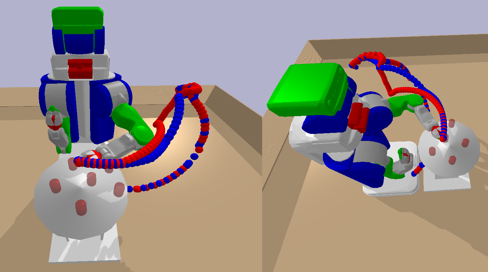

# Motion-planning-and-trajectory-generation
Implementation of collision-avoiding RRT-connect motion planning algorithm in simulated pybullet environment. Explored Dynamical Motion Primitive controller as an alternative for collision-avoiding goal reaching

**Keywords**: manipulation, motion planning

## RRT-connect
<figure>

<figcaption>Collision-free RRT-connect motion trajectory</figcaption>
</figure>

<!-- ## Geometrical-Jacobian IK -->